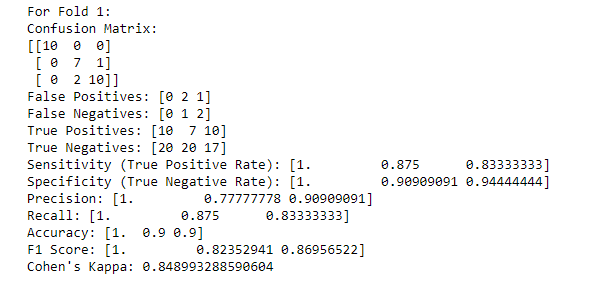
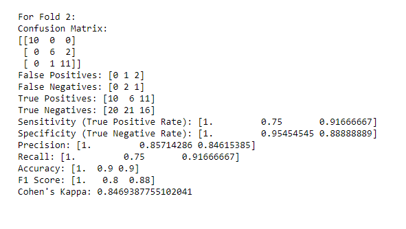
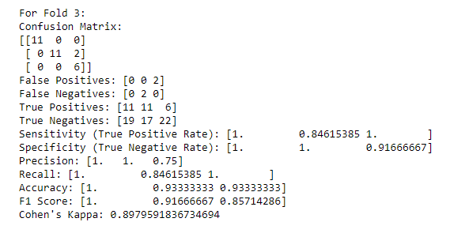
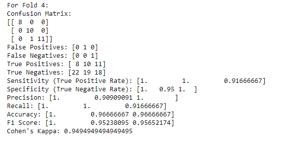
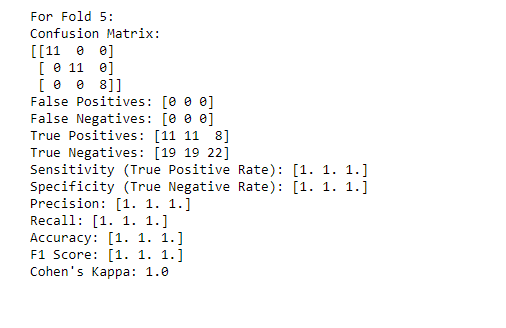
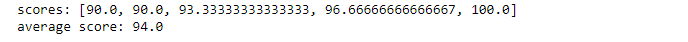

# Artificial-Neural-Networks-From-Scratch

Artificial Neural Networks (ANNs) are computational models inspired by the human brain's neural structure. They consist of interconnected layers of artificial neurons that process input data and learn from it to make predictions. ANNs are widely used for various tasks, such as classification, regression, and pattern recognition, thanks to their ability to learn complex relationships in data through a process called training, which involves adjusting the connections (weights) between neurons.

[ArtificialNeuralNetworksBank-Note] is trained on [Bank-Note Dataset](https://archive.ics.uci.edu/ml/machine-learning-databases/00267/data_banknote_authentication.txt)

[ArtificialNeuralNetworksIris.ipynb](ArtificialNeuralNetworksIris.ipynb) is trained on Iris Dataset from sklearn. It has three layers of neurons: input layer containing 4 neurons corresponding to features (sepal length, sepal width, petal length, petal width), hidden layer containing 5 neurons, and finally output layer containing three neurons corresponding to target classes( encoded as: Setosa-0, Versicolor-1, and Virginica-2). During training, all the weights and biases are updated after processing single training sample and the method is called stochastic training. The update rule uses learning rate of 0.1 and momentum factor of 0.001. The code is run for 150 epochs (i.e. each training example is called 150 times). The activation function is sigmoid of the form f(x) = 1 / 1 + exp(-x). Its range is between 0 and 1.

The dataset is divided into 5 folds and scores are measured taking each fold as test dataset. Dataset was normalized and encoded beforehand. The result are as follows:

